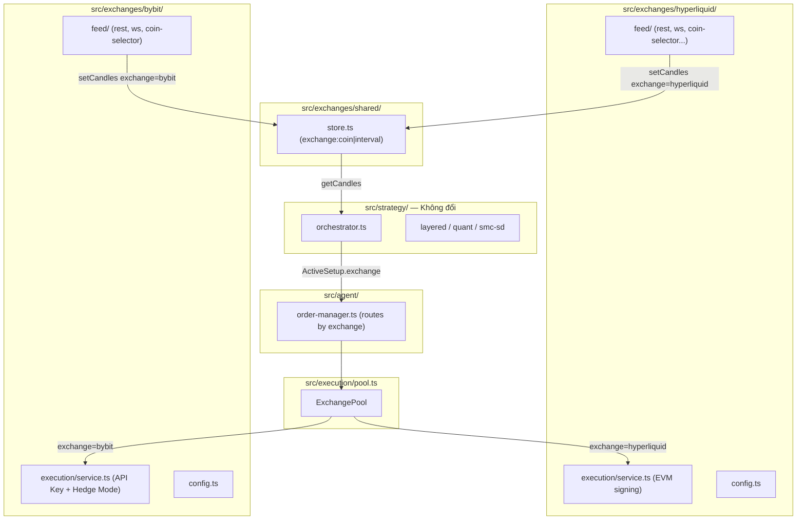

# Bybit Exchange Integration

> **Trạng thái:** MVP đã triển khai (Sprint 4.5 S12 — 2026-04-08)
> **Ngày lập:** 2026-04-08
>
> **Ghi chú:** Kế hoạch ban đầu mô tả refactor cấu trúc `exchanges/` directory — **không thực hiện**. Thay vào đó, S12 triển khai Bybit theo cấu trúc hiện có (`src/feed/bybit/`, `src/execution/bybit-exchange-service.ts`) để giữ blast radius nhỏ nhất. Xem phần **Thực tế triển khai** cuối tài liệu.

## Mục tiêu

- **Refactor cấu trúc** code theo exchange — mỗi sàn có thư mục riêng, tránh conflict khi import
- Chạy **Bybit Linear Futures** song song với Hyperliquid trong cùng 1 process
- **Hedge Mode**: giữ Long và Short cùng lúc trên 1 contract
- **Order by USDT value**: sizing theo notional thay vì coin amount
- **Native SL/TP**: đặt cùng lúc với entry order (không cần trigger order riêng)
- **Backtest Bybit-aware**: commission 0.055%, hedge mode simulation
- Strategy/indicators không đổi — vẫn nhận `Candle[]` thuần túy

---

## Phần 0 — Refactor cấu trúc thư mục

### Cấu trúc hiện tại (vấn đề)

```
src/
  feed/                   ← tất cả là HL-specific nhưng tên chung chung
    rest.ts               ← HL REST (không rõ là HL hay gì)
    ws.ts                 ← HL WS
    store.ts              ← shared (exchange-agnostic) — bị lẫn vào đây
    rate-limiter.ts       ← HL rate limit
    coin-selector.ts      ← HL coins
    asset-ctx.ts, funding.ts, trades.ts, orderbook.ts, perp-info.ts
  execution/
    exchange-service.ts   ← HL-specific nhưng tên chung chung
    exchange-pool.ts
```

**Vấn đề**: Thêm Bybit vào → `exchange-service.ts` không rõ là HL hay Bybit, `feed/rest.ts` không rõ là HL hay Bybit → dễ import nhầm, conflict.

### Cấu trúc mới (mục tiêu)

```
src/
  exchanges/
    hyperliquid/
      feed/
        rest.ts           (moved từ src/feed/rest.ts)
        ws.ts             (moved từ src/feed/ws.ts)
        coin-selector.ts  (moved từ src/feed/coin-selector.ts)
        rate-limiter.ts   (moved từ src/feed/rate-limiter.ts)
        asset-ctx.ts      (moved)
        funding.ts        (moved)
        trades.ts         (moved)
        orderbook.ts      (moved)
        perp-info.ts      (moved)
      execution/
        service.ts        (moved từ src/execution/exchange-service.ts)
      config.ts           (extracted HL-specific constants từ src/config.ts)
      index.ts            (barrel export)
    bybit/
      feed/
        rest.ts           (mới)
        ws.ts             (mới)
        coin-selector.ts  (mới)
        rate-limiter.ts   (mới)
      execution/
        service.ts        (mới — BybitExchangeService)
      config.ts           (mới — Bybit-specific constants)
      index.ts            (barrel export)
    shared/
      store.ts            (moved từ src/feed/store.ts — exchange-agnostic)
      types.ts            (Exchange, re-export Candle, CandleInterval)
  execution/
    pool.ts               (renamed từ exchange-pool.ts, import từ exchanges/)
  feed/                   (thư mục cũ — XÓA sau khi move xong)
  strategy/               (không đổi)
  indicators/             (không đổi)
  backtest/               (minor update)
  agent/                  (cập nhật imports)
  config.ts               (chỉ còn global/shared config)
  types.ts                (global types — giữ nguyên phần shared)
  index.ts                (cập nhật imports)
```

### Config split

| File | Nội dung |
|------|----------|
| `src/config.ts` | Global: TIMEFRAMES, MIN_CANDLES_FOR_SCAN, RISK, PORTFOLIO_RISK, CIRCUIT_BREAKER, backtest defaults, Telegram, Health |
| `src/exchanges/hyperliquid/config.ts` | HL-specific: BACKFILL_CANDLE_COUNTS, REST_BURST_TOKENS, WS_MAX_SUBSCRIPTIONS, HL_MIN_ORDER_NOTIONAL_USD, MARKET_ORDER_SLIPPAGE_PCT, TARGET_MARGIN_PCT, HIP3_DEXES, FALLBACK_COINS |
| `src/exchanges/bybit/config.ts` | Bybit-specific: BYBIT_ENABLED, BYBIT_TOP_COINS_LIMIT, BYBIT_DEFAULT_LEVERAGE, BYBIT_MARGIN_MODE, BYBIT_ORDER_BY_USDT, BYBIT_BACKTEST_COMMISSION_PCT, ... |

### Nguyên tắc import sau refactor

```
src/exchanges/hyperliquid/feed/rest.ts   ← chỉ import từ exchanges/hyperliquid/config.ts
src/exchanges/bybit/feed/rest.ts         ← chỉ import từ exchanges/bybit/config.ts
src/exchanges/shared/store.ts            ← import từ src/types.ts (Candle, Exchange)
src/agent/order-manager.ts              ← import từ cả HL + Bybit execution service
src/strategy/                            ← chỉ import từ exchanges/shared/store.ts + src/types.ts
src/index.ts                             ← import từ exchanges/{hl,bybit}/feed/ để wire
```

---

## Kiến trúc tổng thể (sau refactor)



---

## Phần A — Data Feed

### A1. `src/exchanges/shared/types.ts`

```typescript
export type Exchange = 'hyperliquid' | 'bybit'
```

Thêm vào `ActiveSetup` (src/types.ts):
```typescript
exchange: Exchange
```

### A2. `src/exchanges/shared/store.ts`

Key đổi từ `${coin}|${interval}` → `${exchange}:${coin}|${interval}`.

Tất cả public functions thêm `exchange: Exchange = 'hyperliquid'` (backward compat):
- `appendCandle(coin, interval, candle, exchange?)`
- `setCandles(coin, interval, candles, exchange?)`
- `getCandles(coin, interval, count, exchange?)`
- `candleCount(coin, interval, exchange?)`
- `clearCoinData(coin, exchange?)`

### A3. `src/strategy/orchestrator.ts`

- `onCandleTick(coin, interval, candle, exchange?)` — propagate exchange vào store + scan
- `bootstrapPipelineFromStore(coins, exchange?)` — filter keys theo exchange prefix
- `ActiveSetup` emitted với `exchange` field

### A4. `src/exchanges/bybit/feed/`

```
rest.ts          — fetchBBCandles, fetchBBCandlesBatched, backfillBybit
ws.ts            — kline stream, confirm=true gate, ping keepalive 20s
coin-selector.ts — top N linear perps từ GET /v5/market/tickers
rate-limiter.ts  — token bucket 10 req/s (public endpoints)
```

**Bybit CandleInterval mapping:**

| Minh | Bybit param |
|------|-------------|
| `1m`  | `1`   |
| `5m`  | `5`   |
| `15m` | `15`  |
| `1h`  | `60`  |
| `4h`  | `240` |
| `1d`  | `D`   |

**REST**: `GET https://api.bybit.com/v5/market/kline?category=linear&symbol=BTCUSDT&interval=60&limit=1000`
- Response `result.list`: `[startTime, open, high, low, close, volume, turnover]` — **newest first**, cần reverse
- Max 1000 candles/request (vs HL 500)

**WS**: `wss://stream.bybit.com/v5/public/linear`, topic `kline.1.BTCUSDT`
- `confirm=false` = in-bar tick (bỏ qua)
- `confirm=true` = closed bar (xử lý)

**Symbol mapping**: `BTC` → `BTCUSDT` (thêm `USDT` suffix)

---

## Phần B — Bybit Execution Service

### B1. `src/exchanges/bybit/execution/service.ts` *(mới)*

**Auth**: HMAC-SHA256 với `BYBIT_API_KEY` + `BYBIT_API_SECRET` (khác HL dùng EVM wallet).

**Hedge Mode** — khác biệt lớn nhất so với HL:

```
positionIdx = 1  → Long side
positionIdx = 2  → Short side
```

2 strategies cùng Long 1 coin → Bybit mở 2 position độc lập. Close partial theo qty → không cần đóng toàn bộ.

**Interface:**

```typescript
class BybitExchangeService {
  init(apiKey: string, apiSecret: string): Promise<void>

  // Gọi 1 lần khi khởi động, per symbol
  switchToHedgeMode(symbol: string): Promise<void>        // POST /v5/position/switch-mode mode=3
  setMarginMode(symbol: string, mode: 'isolated' | 'cross'): Promise<void>
  setLeverage(symbol: string, buyLev: number, sellLev: number): Promise<void>

  // Entry order với native SL/TP
  placeOrder(params: BybitPlaceOrderParams): Promise<OrderResult>

  // Partial close — reduceOnly=true, qty = amount cần đóng
  closePosition(symbol: string, side: 'long' | 'short', qty: number): Promise<OrderResult>

  cancelOrder(symbol: string, orderId: string): Promise<void>
  getPositions(): Promise<ExchangePositionSnapshot[]>
  getAccountBalance(): Promise<AccountState>
}
```

**`BybitPlaceOrderParams`:**

```typescript
interface BybitPlaceOrderParams {
  coin: string              // 'BTC' → symbol 'BTCUSDT'
  side: 'long' | 'short'
  type: 'Market' | 'Limit'
  notionalUsdt?: number     // order by USDT value (marketUnit='quoteCoin')
  qty?: number              // hoặc coin amount
  price?: number            // chỉ cần khi type='Limit'
  takeProfit?: number       // native TP price
  stopLoss?: number         // native SL price
  tpTriggerBy?: 'MarkPrice' | 'LastPrice'
  slTriggerBy?: 'MarkPrice' | 'LastPrice'
  maxSlippagePct?: number
  reduceOnly?: boolean
}
```

**Order flow (entry):**

```json
POST /v5/order/create
{
  "category": "linear",
  "symbol": "BTCUSDT",
  "side": "Buy",
  "orderType": "Market",
  "marketUnit": "quoteCoin",
  "qty": "100",
  "positionIdx": 1,
  "takeProfit": "52000",
  "stopLoss": "48000",
  "tpTriggerBy": "MarkPrice",
  "slTriggerBy": "MarkPrice",
  "slippage": "0.01"
}
```

**Partial close:**

```json
POST /v5/order/create
{
  "category": "linear",
  "symbol": "BTCUSDT",
  "side": "Sell",
  "orderType": "Market",
  "qty": "0.001",
  "positionIdx": 1,
  "reduceOnly": true
}
```

**Get positions (Hedge Mode):**

```
GET /v5/position/list?category=linear
→ trả về cả positionIdx=1 (long) và positionIdx=2 (short) cho mỗi symbol
```

### B2. `src/agent/types.ts`

`ExchangePositionSnapshot` thêm:
```typescript
positionIdx?: 1 | 2   // Bybit Hedge Mode: 1=long, 2=short
exchange?: Exchange
```

### B3. `src/execution/pool.ts`

- Import cả `HyperliquidExchangeService` (từ `exchanges/hyperliquid/execution/service.ts`) và `BybitExchangeService`
- Parse `BYBIT_API_KEY` / `BYBIT_API_SECRET` từ env
- Method `getBybitService(): BybitExchangeService | null`
- Method `getHlService(strategyId?): HyperliquidExchangeService`

### B4. `src/agent/order-manager.ts`

Route lệnh theo `ActiveSetup.exchange`:
- `exchange === 'hyperliquid'` → `HyperliquidExchangeService` (không đổi)
- `exchange === 'bybit'` → `BybitExchangeService`

Khi đặt lệnh Bybit:
- `positionIdx = setup.side === 'long' ? 1 : 2`
- Nếu `BYBIT_ORDER_BY_USDT=true` → tính `notionalUsdt` từ risk sizing thay vì coin qty
- SL/TP truyền thẳng vào `placeOrder` (không tạo trigger orders riêng)

---

## Phần C — Config

### `src/exchanges/bybit/config.ts`

```typescript
// ─── Feed ──────────────────────────────────────────────────────────────────
export const BYBIT_ENABLED = process.env.BYBIT_ENABLED !== 'false'
export const BYBIT_TOP_COINS_LIMIT = 20
export const BYBIT_MIN_24H_VOLUME = 1_000_000
export const BYBIT_BACKFILL_CANDLE_COUNTS: Record<string, number> = {
  '1m': 500, '5m': 500, '15m': 2000, '1h': 2000, '4h': 2000, '1d': 2000,
}
export const BYBIT_BACKFILL_BATCH_SIZE = 1000
export const BYBIT_REST_BURST_TOKENS = 10
export const BYBIT_REST_REFILL_MS = 200          // 10 req/s public

// ─── Trading ───────────────────────────────────────────────────────────────
export const BYBIT_MARGIN_MODE: 'isolated' | 'cross' = 'isolated'
export const BYBIT_DEFAULT_LEVERAGE = 5
export const BYBIT_MAX_LEVERAGE = 25
export const BYBIT_ORDER_BY_USDT = true          // true = order by notional USDT
export const BYBIT_MAX_SLIPPAGE_PCT = 0.01       // 1% max slippage market orders
export const BYBIT_MIN_ORDER_NOTIONAL_USD = 5    // min $5 (vs HL $10)
export const BYBIT_TP_TRIGGER_BY = 'MarkPrice' as const
export const BYBIT_SL_TRIGGER_BY = 'MarkPrice' as const

// ─── Backtest ──────────────────────────────────────────────────────────────
export const BYBIT_BACKTEST_COMMISSION_PCT = 0.00055  // 0.055% taker (linear)
export const BYBIT_BACKTEST_SLIPPAGE_PCT = 0.0005     // 0.05%
```

**Env vars:**

| Var | Mô tả |
|-----|-------|
| `BYBIT_API_KEY` | API Key (Trade permission) |
| `BYBIT_API_SECRET` | API Secret |
| `BYBIT_ENABLED=false` | Tắt Bybit hoàn toàn |
| `BYBIT_TESTNET=true` | Dùng `api-testnet.bybit.com` |

---

## Phần D — Backtest Bybit

### `src/backtest/types.ts`

```typescript
interface BacktestConfig {
  // ...existing fields...
  exchange?: Exchange       // 'hyperliquid' | 'bybit', default 'hyperliquid'
  hedgeMode?: boolean       // Bybit: track long + short độc lập
  commissionPct?: number    // override default (per exchange)
  slippagePct?: number
}
```

### `src/backtest/engine.ts`

- Commission mặc định: `BYBIT_BACKTEST_COMMISSION_PCT` khi `exchange='bybit'`, `BACKTEST_COMMISSION_PCT` khi HL
- Khi `hedgeMode=true`: `Map<positionIdx, Position>` — long và short track riêng biệt, partial close theo qty
- Walk-forward và simulator kế thừa `exchange` + `hedgeMode` từ config

---

## Files — tổng hợp

### Di chuyển (không thay đổi logic)

| Từ | Đến |
|----|-----|
| `src/feed/rest.ts` | `src/exchanges/hyperliquid/feed/rest.ts` |
| `src/feed/ws.ts` | `src/exchanges/hyperliquid/feed/ws.ts` |
| `src/feed/coin-selector.ts` | `src/exchanges/hyperliquid/feed/coin-selector.ts` |
| `src/feed/rate-limiter.ts` | `src/exchanges/hyperliquid/feed/rate-limiter.ts` |
| `src/feed/asset-ctx.ts` | `src/exchanges/hyperliquid/feed/asset-ctx.ts` |
| `src/feed/funding.ts` | `src/exchanges/hyperliquid/feed/funding.ts` |
| `src/feed/trades.ts` | `src/exchanges/hyperliquid/feed/trades.ts` |
| `src/feed/orderbook.ts` | `src/exchanges/hyperliquid/feed/orderbook.ts` |
| `src/feed/perp-info.ts` | `src/exchanges/hyperliquid/feed/perp-info.ts` |
| `src/feed/store.ts` | `src/exchanges/shared/store.ts` |
| `src/execution/exchange-service.ts` | `src/exchanges/hyperliquid/execution/service.ts` |
| `src/execution/exchange-pool.ts` | `src/execution/pool.ts` |

### Thay đổi nội dung

- `src/types.ts` — thêm `Exchange` type, `ActiveSetup.exchange`
- `src/agent/types.ts` — `ExchangePositionSnapshot.positionIdx`, `.exchange`
- `src/config.ts` — bỏ HL-specific constants (đã move sang HL config)
- `src/exchanges/hyperliquid/config.ts` — HL-specific constants (extracted)
- `src/strategy/orchestrator.ts` — exchange param cho `onCandleTick`, `bootstrapPipelineFromStore`
- `src/execution/pool.ts` — import cả HL + Bybit service
- `src/agent/order-manager.ts` — route theo `ActiveSetup.exchange`
- `src/backtest/types.ts` — `exchange`, `hedgeMode`, commission override
- `src/backtest/engine.ts` — per-exchange commission, Hedge Mode tracking
- `src/index.ts` — wire Bybit feed + execution khi `BYBIT_ENABLED`

### Tạo mới

- `src/exchanges/hyperliquid/index.ts`
- `src/exchanges/bybit/feed/rest.ts`
- `src/exchanges/bybit/feed/ws.ts`
- `src/exchanges/bybit/feed/coin-selector.ts`
- `src/exchanges/bybit/feed/rate-limiter.ts`
- `src/exchanges/bybit/execution/service.ts`
- `src/exchanges/bybit/config.ts`
- `src/exchanges/bybit/index.ts`
- `src/exchanges/shared/store.ts` *(moved)*
- `src/exchanges/shared/types.ts`

### Không thay đổi

- `src/indicators/` — pure functions, zero exchange dependencies
- `src/strategy/strategies/` — nhận `Candle[]`
- `src/db/`, `src/ui/`, `src/alert/`, `src/analytics/`, `src/lib/`

---

## Thứ tự triển khai

1. **Refactor cấu trúc thư mục** — tạo `exchanges/` skeleton, move files, update imports → `bun test --run` pass
2. **Types + shared store** — thêm `Exchange`, exchange-namespaced store key
3. **Bybit feed** — rest, ws, coin-selector, rate-limiter
4. **Bybit execution service** — API Key auth, Hedge Mode, native SL/TP
5. **Execution pool + order-manager routing** — wire theo exchange
6. **Backtest Bybit** — commission, hedgeMode
7. **Wire index.ts** — init Bybit khi BYBIT_ENABLED
8. **Test toàn bộ** — `bun test --run` pass

---

## Risks & Notes

- **Hedge Mode phải switch trước** — `POST /v5/position/switch-mode mode=3` khi khởi động. Account đang One-Way Mode sẽ bị reject.
- **Bybit WS kline**: chỉ xử lý `confirm=true` — bỏ in-bar ticks như HL WS.
- **Symbol format**: `BTC` → `BTCUSDT`. Một số coins có format khác trên Bybit (e.g. `1000PEPE`). Coin selector Bybit tự resolve — không cần cross-exchange name mapping.
- **API Key scope**: cần permission "Contract - Orders" và "Contract - Positions". Không cần Withdrawal.
- **Bybit testnet**: endpoint `https://api-testnet.bybit.com` khi `BYBIT_TESTNET=true`.
- **Rate limit private**: 10 req/s per API key cho trading endpoints — rate limiter riêng cho private calls.
- **Import discipline**: không bao giờ `import` từ `exchanges/hyperliquid/` trong `exchanges/bybit/` và ngược lại. Chỉ qua `exchanges/shared/`.

---

## Thực tế triển khai (Sprint 4.5 S12 — 2026-04-08)

Kế hoạch gốc (refactor `exchanges/` directories) **không thực hiện** trong S12. Thay vào đó triển khai MVP với blast radius tối thiểu.

### Quyết định kiến trúc (so với kế hoạch)

| Hạng mục | Kế hoạch | Thực tế |
|----------|----------|---------|
| Cấu trúc thư mục | Refactor sang `src/exchanges/hyperliquid/` + `src/exchanges/bybit/` | Giữ nguyên `src/feed/bybit/` + `src/execution/bybit-exchange-service.ts` |
| ExchangePool | Multi-wallet: `Map<strategyId, ExchangeService>` | **Single shared wallet**: 1 instance cho tất cả strategies (đơn giản hóa từ S4) |
| Store key | `exchange:coin\|interval` | Giữ nguyên `coin\|interval` — tất cả feed đổ vào shared store |
| ActiveExchange | `BYBIT_ENABLED=true` cạnh HL | **Mutual exclusive**: `ACTIVE_EXCHANGE=HL` hoặc `BB` (1 exchange per process) |
| Backtest Bybit | Hedge mode simulation + commission | Chưa triển khai (deferred) |

### Files đã tạo (S12)

| File | Mô tả |
|------|-------|
| `src/execution/bybit-exchange-service.ts` | BybitExchangeService — placeOrder, cancelOrder, getPositions, getAccountState, setLeverage |
| `src/feed/bybit/bybit-feed.ts` | BybitFeed — backfill + WS subscribe, implements IExchangeFeed |
| `src/feed/bybit/bybit-rest.ts` | REST backfill + funding rate cache (loadBybitFundingRates) |
| `src/feed/bybit/bybit-ws.ts` | WS kline stream (`confirm=true` gate, ping keepalive) |
| `src/feed/bybit/bybit-coin-selector.ts` | Top N linear perps từ getTickers theo volume |
| `src/feed/bybit/bybit-rate-limiter.ts` | Token bucket 120 burst, 10/s sustained |
| `src/feed/exchange-feed.ts` | `IExchangeFeed` interface (shared contract cho HL + Bybit) |

### Files đã sửa (S12)

| File | Thay đổi |
|------|---------|
| `src/execution/exchange-pool.ts` | Simplified: ExchangePool là single shared wallet (remove per-strategy multi-wallet). `BB` mode → `BybitExchangeService`. `HL` mode → `ExchangeService` |
| `src/config.ts` | Thêm `BYBIT_*` constants, `getActiveExchange()`, `BYBIT_FUNDING_REFRESH_MS` |
| `src/agent/types.ts` | Thêm `order_submitted` AgentEvent type (pendingOrderId tracking) |
| `src/agent/trading-orchestrator.ts` | Fix critical bug: tách `applyEventContext` (once per dispatch) vs `applyActionContext` (per action) |
| `src/feed/coin-selector.ts` | `createCoinSelector()` factory — routes HL vs BB |
| `src/index.ts` | BB mode startup: BybitFeed, funding rate refresh loop, single-wallet cleanup |

### Bugs fixed trong S12 (phát hiện qua /review + /cso)

1. **`applyContextUpdate` chạy trong action loop** — `order_submitted` event sinh `actions: []` → loop không chạy → `ctx.pendingOrderId` không bao giờ được set → live orders không bị cancel khi setup invalidated. Fix: tách thành `applyEventContext()` (once per dispatch) + `applyActionContext()` (per action).
2. **Stale funding rate cache** — `loadBybitFundingRates` không clear map trước khi refresh → coins delisted tích lũy mãi. Fix: `fundingRates.clear()` trước vòng lặp.
3. **Magic number** — `ticker.symbol.slice(0, -4)` → `slice(0, -'USDT'.length)`. `4 * 60 * 60 * 1000` → `BYBIT_FUNDING_REFRESH_MS`.
4. **Dead code** — `isMultiWallet()` always returns `false` nhưng 3 branches trong `index.ts` vẫn check → đã xóa.

### Known gaps (deferred)

- Bybit không có dead man's switch — cần implement cancel-all-orders trong `cleanup()` + SIGTERM handler (xem /cso finding #1)
- `modifyTrigger` không được implement trên Bybit (trail stop = no-op)
- `getFillAggregateByCloid` không được implement (fill price estimate only)
- Stale multi-account env vars trong `.env.example` (`PRIVATE_KEY_LAYERED`, `STRATEGY_WALLETS`, `BYBIT_STRATEGY_KEYS`) — cần cleanup

### Test coverage (1148 pass sau S12)

- `test/feed/bybit/` — bybit-rest, bybit-ws, bybit-feed tests
- `test/feed/bybit/bybit-coin-selector.test.ts` — coin selector ranking
- `test/execution/bybit-exchange-service.test.ts` — placeOrder, cancelOrder, getAccountState
